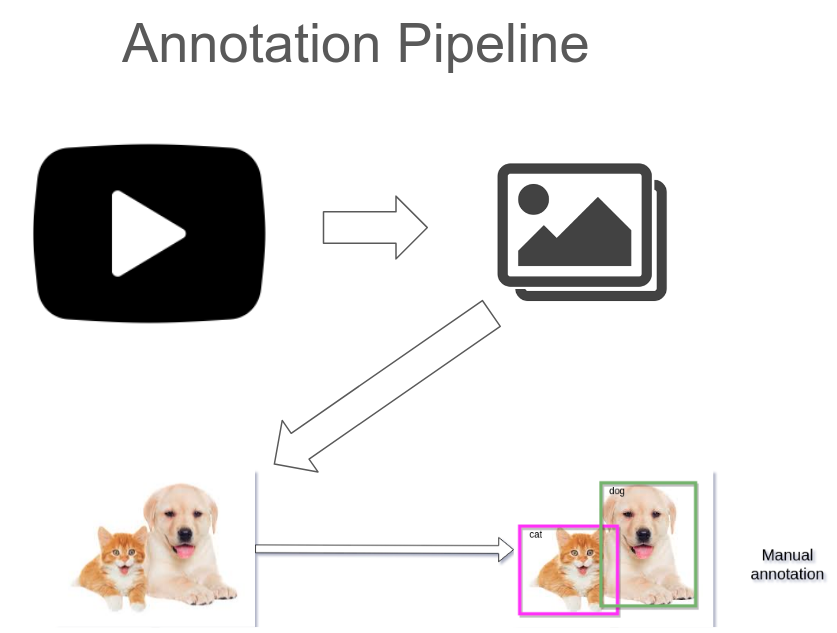
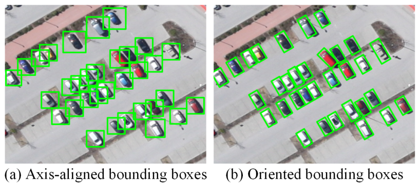
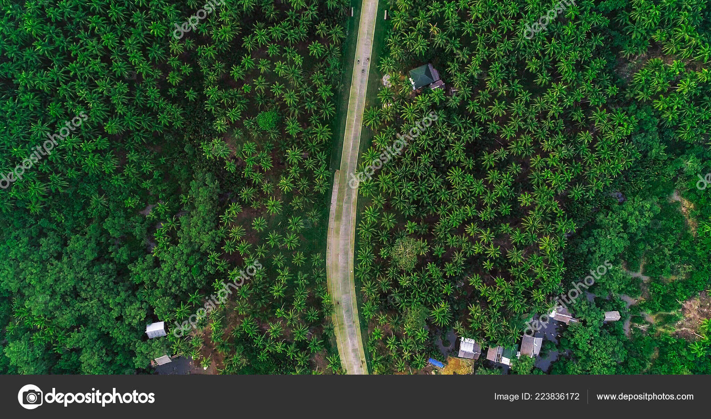

## Training Pipeline


### Rotate bounding box for a better fit (esp. in Aerial Settings)



Image from: https://www.mdpi.com/2072-4292/9/11/1170/htm

## Video Tutorial
You can refer to the video at Desktop.

```SETTING_UP.mp4```

```HOW_TO_ANNOTATE.mp4```

## Step 1: Convert Video to Frames

Open new Terminal **(Ctrl + Alt + T)**

To paste in terminal: **(Ctrl + Shift + V)**

Type command in terminal: 

  - ```xdg-open $raw_video```

Store the respective videos into the opened folder

Go back to the Terminal

Type command in terminal: 

  - ```bash ~/Desktop/video2frame.sh```

You should see a "Video2Frames Completed" message from the terminal

## Step 2: Annotate Frames

Go back to the Terminal

Type command in terminal: 

  - ```bash ~/Desktop/annotate.sh```

### Brief Instructions for annotation
1. Open Dir **(Ctrl + U)** 
  - Choose the folder that you want to annotate.
    - ```/workspace/videos/<video_name>```
  
  - "Save annotations to the directory"
    - Choose the same folder as before.

2. Annotate
  - **Be sure to checkout this [annotation guide first](./Object%20Detection%20Annotation%20Guide.html).**
  - You can refer to the ```HOW_TO_ANNOTATE.mp4``` at Desktop too.

### Rule of thumb: Image should be capturing the ground image.

#### 'no_target_in_ao' should be annotated when the area of interest has no target.

### Example of 'no_target_in_ao'



### Example of an image that can be skipped **(no annotation needed)**


~~~~~~~
+------------+--------------------------------------------+
| Create Box | Click 'Create OrientatedRectBox' or 'w'    |
+------------+--------------------------------------------+
| Rotate Box | Right-click the box vertices (red dots)    |
+------------+--------------------------------------------+
|            | & drag clockwise/ anti-clockwise           |
+------------+--------------------------------------------+
| Resize Box | Left-click the box vertices (red dots)     |
+------------+--------------------------------------------+
|            | & drag in/ out                             |
+------------+--------------------------------------------+
| Delete Box | Select Box and Press 'del' button          |
+------------+--------------------------------------------+
| Save Box   | Click 'Save' or 'Ctrl S' and Enter         |
+------------+--------------------------------------------+
|            | Do not change annotation path              |
+------------+--------------------------------------------+


|------------|--------------------------------------------|
| Create Box | Click 'Create OrientatedRectBox' or 'w'    |
| Rotate Box | Right-click the box vertices (red dots)    |
|            | & drag clockwise/ anti-clockwise           |
| Resize Box | Left-click the box vertices (red dots)     |
|            | & drag in/ out                             |
| Delete Box | Select Box and Press 'del' button          |
| Save Box   | Click 'Save' or 'Ctrl S' and Enter         |
|            | Do not change annotation path              |


~~~~~~~

3. After annotating a video folder, update records in **video_tracker.ods** at Desktop

### Shortcuts

#### Saving Issue
- Under 'View' tab, check that "Auto-Save" mode is on
  - By auto-saving, you will not have to constantly choose the directory to save.

#### Black / Pixelated Pop-ups
- This is a known bug that we are looking into.
  - If you encounter this, please perform the same action 
    again, and it will work.

#### Hotkeys
~~~~~~~

+------------+--------------------------------------------+
| Ctrl + u   | Load all of the images from a directory    |
+------------+--------------------------------------------+
| Ctrl + s   | Save                                       |
+------------+--------------------------------------------+
| Ctrl + d   | Copy the current label and rect box        |
+------------+--------------------------------------------+
| w          | Create a rect box                          |
+------------+--------------------------------------------+
| d          | Next image                                 |
+------------+--------------------------------------------+
| a          | Previous image                             |
+------------+--------------------------------------------+
| del        | Delete the selected rect box               |
+------------+--------------------------------------------+
| Ctrl++     | Zoom in                                    |
+------------+--------------------------------------------+
| Ctrl--     | Zoom out                                   |
+------------+--------------------------------------------+
|            | Keyboard arrows to move selected rect box  |
+------------+--------------------------------------------+
~~~~~~~